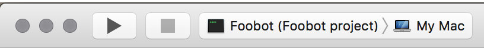
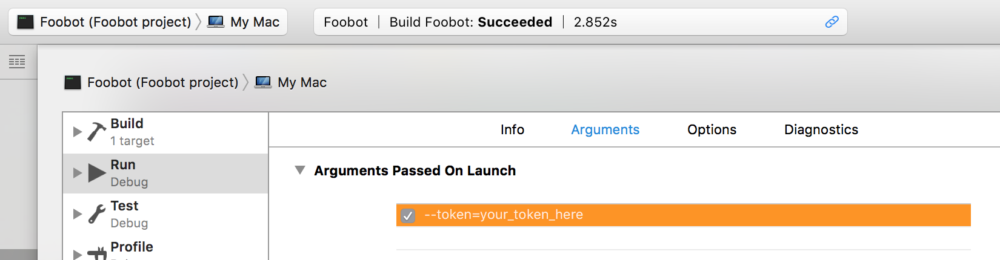

# Contributing

We love contributions from everyone.
By participating in this project,
you agree to abide by the iOS Developers HQ [code of conduct].

  [code of conduct]: http://ios-developers.io/coc/

We expect everyone to follow the code of conduct
anywhere in iOS Developers HQ's project codebases,
issue trackers and slack channels.

<br/>

# Preparing to contribute
Before you can start developing be sure to read through the following first:

## Xcode 8
You will first need Xcode 8, you can download it at [Apple Developer Downloads.](https://developer.apple.com/download/)
After your downloded completes drag it into your `Applications` folder to install it.
Finally you need to select Xcode 8 for your `Command Line Tools`, you can do this from Xcode 8
preferences (`cmd` + `,`). Go to the `Locations` tab, under `Command Line Tools` choose `Xcode 8`

## Swift 3
You need Swift 3 installed to contribute, I recommend using [swiftenv](https://github.com/kylef/swiftenv).
Once you have `swiftenv` installed run the following commands in a terminal window.

```
swiftenv install DEVELOPMENT-SNAPSHOT-2016-07-25-a
swiftenv global DEVELOPMENT-SNAPSHOT-2016-07-25-a
```

This will install the snapshot and set it as the default installation of Swift 3.

## Slack
You will need to [create](https://slack.com/create) a slack team you can use for testing.
Next [configure](https://my.slack.com/services/new/bot) a new bot user for your team. 
Make sure you copy the token, you will need it later.

## Local setup
First create a fork of the Foobot repo, then clone your forked repo to your local machine.

Next type
```
swift package generate-xcodeproj
```
in your terminal, this will download all the dependencies and generate the `.xcodeproj` file.

Finally, make sure you create a new branch for your contribution then you can open the `.xcodeproj`.

*Make sure you refer to the [Contributing Code](#contributing-code) section for specifics on what is expected of the code you submit*

## Running locally
Ensure you have the right scheme chosen in xcode:
 

Now edit the scheme and add a `--token` parameter. This is the bot user token you received when you created the slack bot user earlier.
 

You should be able to run the bot now and invite it to channels in your slack team.

## Pushing changes
Push to your fork. Write a [good commit message](http://tbaggery.com/2008/04/19/a-note-about-git-commit-messages.html). 
Submit a pull request.

Others will give constructive feedback.
This is a time for discussion and improvements,
and making the necessary changes will be required before we can
merge the contribution.

<br/>

# Contributing code
## Convention
Please make sure you are following the conventions of the existing code.

## Branches
Make your branch names short yet descriptive of whats in them. 
You should also be keeping them up to date with `master`

## Commit messages
Keep them short, under 50 characters is ideal. 
Make them [atomic][1], one commit message should pair with one change. 
If you have to add an “and” in your commit message, you’ve already committed too much.

## Pull requests
Provide a short description of what the code does and why it should be added to the project.
Bullet lists of the contribution are fine and should be easy if your commit messages are also simple.

## References:
- [Git Style Guide](https://github.com/agis-/git-style-guide)
- [How to Write a Git Commit Message](http://chris.beams.io/posts/git-commit/)
- [Keep your commits "Atomic"][1]

[1]: https://www.freshconsulting.com/atomic-commits/

<br/>

# Troubleshooting
### OpenSSL Errors on OSX
If you are unable to build/run locally due to an `openssl` error, you may need to run the following in terminal:

```
brew install openssl
brew link openssl
```